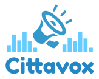

# Cittavox Docs

  

Gestão colaborativa das cidades

## Descrição
A Citta é uma empresa de tecnologia sediada em Recife que desenvolve negócios de impacto social. A Citta desenvolve soluções tecnológicas para a gestão colaborativa das cidades, com o objetivo de melhorar a qualidade de vida dos cidadãos e a eficiência da gestão pública.

## Artefatos:
  - [Plano do Projeto](https://docs.google.com/document/d/e/2PACX-1vS9GIu5bdN2a10EWafwahVOBDZhijZqbSR7Svp77YgR3vU6fwUGC3ZzslGJaNaTUfRvpmjRZshROpGd/pub)
  - [Termo de Abertura do Projeto](https://github.com/jrsmarcilio/cittavox-docs/blob/main/termo-abertura-do-projeto.md)
  - Planejamento do Escopo
    - [Plano de gerenciamento do escopo](https://github.com/jrsmarcilio/cittavox-docs/blob/4a8619bd43bb6e99821a98dc579696c82a093eed/planejamento/escopo/escopo.md)
    - [EAP](https://miro.com/app/board/uXjVMJVVRiA=/?share_link_id=95330730484)
    - [CardPanel](https://miro.com/app/board/uXjVMJVVRiA=/?openCardPanel=3458764554316707647)
    - [Issue](https://github.com/jrsmarcilio/cittavox-docs/issues/2)
  - Planejamento da Equipe
    - Organograma
      - [Documento](https://github.com/jrsmarcilio/cittavox-docs/blob/4a8619bd43bb6e99821a98dc579696c82a093eed/planejamento/equipe/organograma.md)
      - [PDF](https://github.com/jrsmarcilio/cittavox-docs/blob/4a8619bd43bb6e99821a98dc579696c82a093eed/assets/organograma-da-equipe.pdf)
    - [Papéis e Responsabilidades](https://github.com/jrsmarcilio/cittavox-docs/blob/4a8619bd43bb6e99821a98dc579696c82a093eed/planejamento/equipe/matriz-de-responsabilidade.md)
  - Cronograma
    - [Cronograma](https://github.com/jrsmarcilio/cittavox-docs/blob/4a8619bd43bb6e99821a98dc579696c82a093eed/cronograma/cronograma.xlsx)
    - [Plano de gerenciamento do cronograma]()

  - Planejamento do Custo (planilha de custos do projeto);
  - Planejamento da Comunicação;
  - Plano de gerenciamento da qualidade;
  - Planejamento das Aquisições;
  - Plano de gerenciamento de riscos;

# - - - 

# Copilot 

# 2. Planejamento do Projeto

## Cronograma
  - O cronograma do projeto foi elaborado com base nas estimativas de tempo e custo apresentadas anteriormente. O cronograma inclui as atividades do projeto, os recursos necessários e o tempo estimado para a realização de cada atividade.
  - O cronograma do projeto está disponível no arquivo `cronograma.xlsx` na pasta `cronograma` deste repositório.
  - O cronograma do projeto será atualizado ao longo do projeto, conforme as atividades forem sendo realizadas e os resultados forem sendo alcançados.

## Orçamento
  - O orçamento do projeto foi elaborado com base nas estimativas de tempo e custo apresentadas anteriormente. O orçamento inclui os recursos humanos e materiais necessários para a realização do projeto.
  - O orçamento do projeto está disponível no arquivo `orcamento.xlsx` na pasta `orcamento` deste repositório.
  - O orçamento do projeto será atualizado ao longo do projeto, conforme as atividades forem sendo realizadas e os resultados forem sendo alcançados.

## Riscos
  - Os riscos do projeto foram identificados e classificados de acordo com a sua probabilidade de ocorrência e o seu impacto no projeto.
  - Os riscos do projeto estão disponíveis no arquivo `riscos.xlsx` na pasta `riscos` deste repositório.
  - Os riscos do projeto serão atualizados ao longo do projeto, conforme as atividades forem sendo realizadas e os resultados forem sendo alcançados.