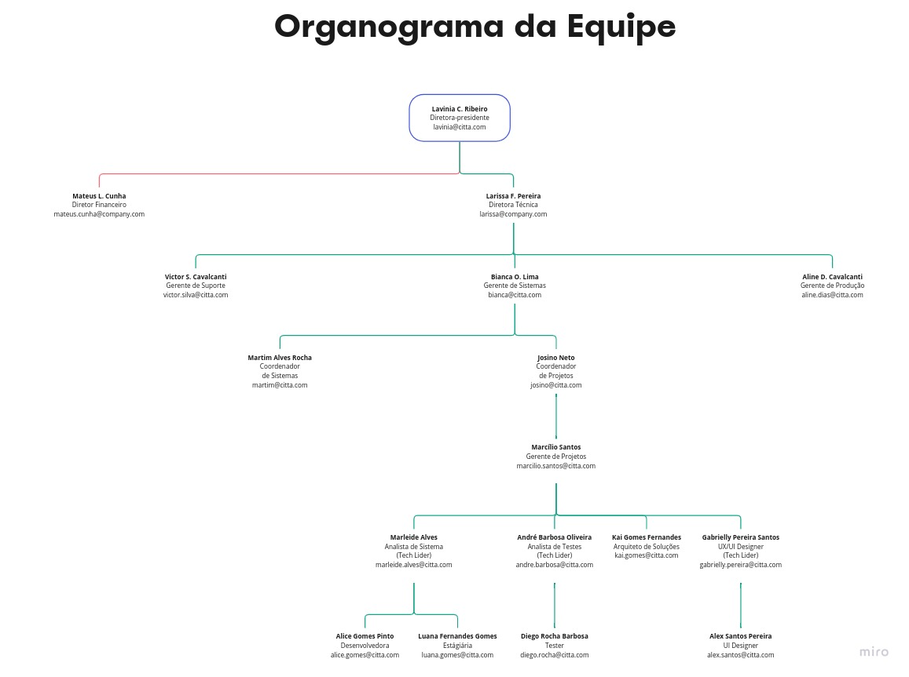

# Organograma da equipe

## Estrutura organizacional
A estrutura da organização afeta diretamente o projeto, mostrando características relacionadas a projetos dos principais tipos de estruturas organizacionais. No caso da Citta, a estrutura organizacional é matricial forte, pois os gerentes de projeto têm autoridade total sobre o projeto e os recursos são alocados em tempo integral.

| Estrutura da organizacão / Características do projeto | Funcional | Matricial Fraca | Matricial Balanceada | Matricial Forte | Por projeto |
| --- | --- | --- | --- | --- | --- |
| Autoridade do gerente de projeto | Pouca ou nenhuma | Limitada | Baixa ou moderada | Alta a quase total | Misto |
| Disponibilidade dos recursos | Tempo integral | Tempo integral | Tempo integral | Tempo integral | Tempo parcial |
| Quem controla o orçamento | Gerente funcional | Gerente de projeto | Gerente de projeto | Gerente de projeto | Gerente de projeto |
| Quem controla o cronograma | Gerente funcional | Gerente de projeto | Gerente de projeto | Gerente de projeto | Gerente de projeto |
| Função do gerente de projeto | Gerente funcional | Gerente de projeto | Gerente de projeto | Gerente de projeto | Gerente de projeto |
| Equipe administrativa | Gerente funcional | Gerente de projeto | Gerente de projeto | Gerente de projeto | Gerente de projeto |
| Equipe de projeto | Gerente funcional | Gerente de projeto | Gerente de projeto | Gerente de projeto | Gerente de projeto |
| Equipe de projeto | Gerente funcional | Gerente de projeto | Gerente de projeto | Gerente de projeto | Gerente de projeto |

## Equipe

| Nome | Cargo | E-mail |
|--------|--------|--------|
| Lavinia C. Ribeiro | Diretora-presidente | lavinia@citta.com |
| Mateus L. Cunha | Diretor Financeiro | mateus.cunha@company.com |
| Larissa F. Pereira | Diretora Técnica | larissa@company.com |
| Victor S. Cavalcanti | Gerente de Suporte | victor.silva@citta.com |
| Bianca O. Lima | Gerente de Sistemas | bianca@citta.com |
| Aline D. Cavalcanti | Gerente de Produção | aline.dias@citta.com |
| Martim Alves Rocha | Coordenador de Sistemas | martim@citta.com |
| Josino Neto | Coordenador de Projetos | josino@citta.com |
| Marleide Alves | Analista de Sistema - Tech Lider | marleide.alves@citta.com |
| André Barbosa Oliveira | Analista de Testes - Tech Lider | andre.barbosa@citta.com |
| Kai Gomes Fernandes | Arquiteto de Soluções | kai.gomes@citta.com |
| Gabrielly Pereira Santos | UX/UI Designer - Tech Lider | gabrielly.pereira@citta.com |
| Alice Gomes Pinto | Desenvolvedora | alice.gomes@citta.com |
| Luana Fernandes Gomes | Estágiária | luana.gomes@citta.com |
| Diego Rocha Barbosa | Tester | diego.rocha@citta.com |
| Alex Santos Pereira | UI Designer | alex.santos@citta.com |

## Papéis e Responsabilidades

Quadro 1 - Papéis e Responsabilidades
| Papel | Responsabilidades |
|--------|--------|
| Diretora-presidente | A diretora-presidente é responsável por garantir que a empresa atinja seus objetivos, ou seja, ela é responsável por garantir que a empresa seja lucrativa e que os clientes estejam satisfeitos. |
| Diretor Financeiro | O diretor financeiro é responsável por garantir que a empresa tenha recursos financeiros suficientes para atingir seus objetivos, ou seja, ele é responsável por garantir que a empresa tenha dinheiro suficiente para pagar os salários dos funcionários, pagar as contas e investir em novos projetos. |
| Diretora Técnica | A diretora técnica é responsável por garantir que a empresa tenha os recursos técnicos necessários para atingir seus objetivos, ou seja, ela é responsável por garantir que a empresa tenha os recursos humanos e tecnológicos necessários para atender às necessidades dos clientes. |
| Gerente de Suporte | O gerente de suporte é responsável por garantir que os clientes estejam satisfeitos, ou seja, ele é responsável por garantir que os clientes recebam o suporte necessário para utilizar os produtos da empresa. |
| Gerente de Sistemas | O gerente de sistemas é responsável por garantir que os sistemas da empresa estejam funcionando corretamente, ou seja, ele é responsável por garantir que os sistemas da empresa estejam funcionando corretamente. |
| Gerente de Produção | O gerente de produção é responsável por garantir que os produtos da empresa sejam entregues no prazo, ou seja, ele é responsável por garantir que os produtos da empresa sejam entregues no prazo. |
| Coordenador de Sistemas | O coordenador de sistemas é responsável por garantir que os sistemas da empresa estejam funcionando corretamente, ou seja, ele é responsável por garantir que os sistemas da empresa estejam funcionando corretamente. |
| Coordenador de Projetos | O coordenador de projetos é responsável por garantir que os projetos da empresa sejam entregues no prazo, ou seja, ele é responsável por garantir que os projetos da empresa sejam entregues no prazo. |
| Analista de Sistema | O analista de sistema é responsável por garantir que os sistemas da empresa estejam funcionando corretamente, ou seja, ele é responsável por garantir que os sistemas da empresa estejam funcionando corretamente. |
| Analista de Testes | O analista de testes é responsável por garantir que os sistemas da empresa estejam funcionando corretamente, ou seja, ele é responsável por garantir que os sistemas da empresa estejam funcionando corretamente. |
| Arquiteto de Soluções | O arquiteto de soluções é responsável por garantir que os sistemas da empresa estejam funcionando corretamente, ou seja, ele é responsável por garantir que os sistemas da empresa estejam funcionando corretamente. |
| UX/UI Designer | O UX/UI Designer é responsável por garantir que os sistemas da empresa estejam funcionando corretamente, ou seja, ele é responsável por garantir que os sistemas da empresa estejam funcionando corretamente. |
| Desenvolvedor | O desenvolvedor é responsável por garantir que os sistemas da empresa estejam funcionando corretamente, ou seja, ele é responsável por garantir que os sistemas da empresa estejam funcionando corretamente. |
| Estágiária | A estagiária é responsável por garantir que os sistemas da empresa estejam funcionando corretamente, ou seja, ela é responsável por garantir que os sistemas da empresa estejam funcionando corretamente. |
| Tester | O tester é responsável por garantir que os sistemas da empresa estejam funcionando corretamente, ou seja, ele é responsável por garantir que os sistemas da empresa estejam funcionando corretamente. |
| UI Designer | O UI Designer é responsável por garantir que os sistemas da empresa estejam funcionando corretamente, ou seja, ele é responsável por garantir que os sistemas da empresa estejam funcionando corretamente. |

Faça o download do PDF para visualizá-lo: <a href="../../assets/organograma-da-equipe.pdf">Download PDF</a>.

Para ajudar a fornecer informações mais precisas, aqui estão algumas descrições adicionais de papéis com responsabilidades mais detalhadas:

| Papel | Responsabilidades |
|--------|--------|
| Gerente de Marketing | O gerente de marketing é responsável por desenvolver e executar estratégias de marketing para promover a empresa e seus produtos ou serviços, aumentar a conscientização da marca, gerar leads e aumentar as vendas. Ele deve colaborar com outros departamentos para garantir que a mensagem da empresa seja consistente e apropriada. |
| Gerente de Recursos Humanos | O gerente de recursos humanos é responsável por garantir que a empresa tenha uma força de trabalho qualificada e engajada, recrutando e selecionando candidatos, gerenciando benefícios e salários, treinando funcionários e gerenciando conflitos ou problemas de desempenho. |
| Gerente de Vendas | O gerente de vendas é responsável por liderar e orientar a equipe de vendas da empresa, definir metas de vendas e monitorar o desempenho da equipe para garantir que as metas sejam atingidas. Ele deve colaborar com outros departamentos para garantir que os clientes recebam um atendimento excepcional e sejam bem-sucedidos com os produtos ou serviços da empresa. |
| Engenheiro de Software | O engenheiro de software é responsável por projetar, desenvolver e testar software para a empresa. Ele deve colaborar com outros departamentos para garantir que as soluções desenvolvidas atendam às necessidades dos clientes e da empresa, além de serem escaláveis e seguras. |
| Analista de Dados | O analista de dados é responsável por coletar, analisar e interpretar dados para ajudar a empresa a tomar decisões melhores e mais informadas. Ele deve colaborar com outros departamentos para entender as necessidades de dados da empresa e garantir que os dados sejam coletados e analisados de forma apropriada e ética. |
| Gerente de Operações | O gerente de operações é responsável por gerenciar os processos e recursos da empresa para garantir a eficiência, qualidade e segurança. Ele deve colaborar com outros departamentos para garantir que as operações estejam alinhadas com os objetivos da empresa e que as melhores práticas sejam seguidas. |
| Analista de Segurança | O analista de segurança é responsável por garantir que os sistemas e dados da empresa estejam protegidos contra ameaças externas e internas. Ele deve colaborar com outros departamentos para entender as necessidades de segurança da empresa e implementar soluções de segurança eficazes. |
| Gerente de Produto | O gerente de produto é responsável por liderar a definição, desenvolvimento e lançamento de produtos ou serviços da empresa. Ele deve colaborar com outros departamentos para garantir que os produtos atendam às necessidades dos clientes e da empresa, além de serem competitivos no mercado. |
| Analista de Negócios | O analista de negócios é responsável por identificar e analisar problemas de negócios e recomendar soluções. Ele deve colaborar com outros departamentos para entender as necessidades da empresa e garantir que as soluções propostas atendam a essas necessidades. |